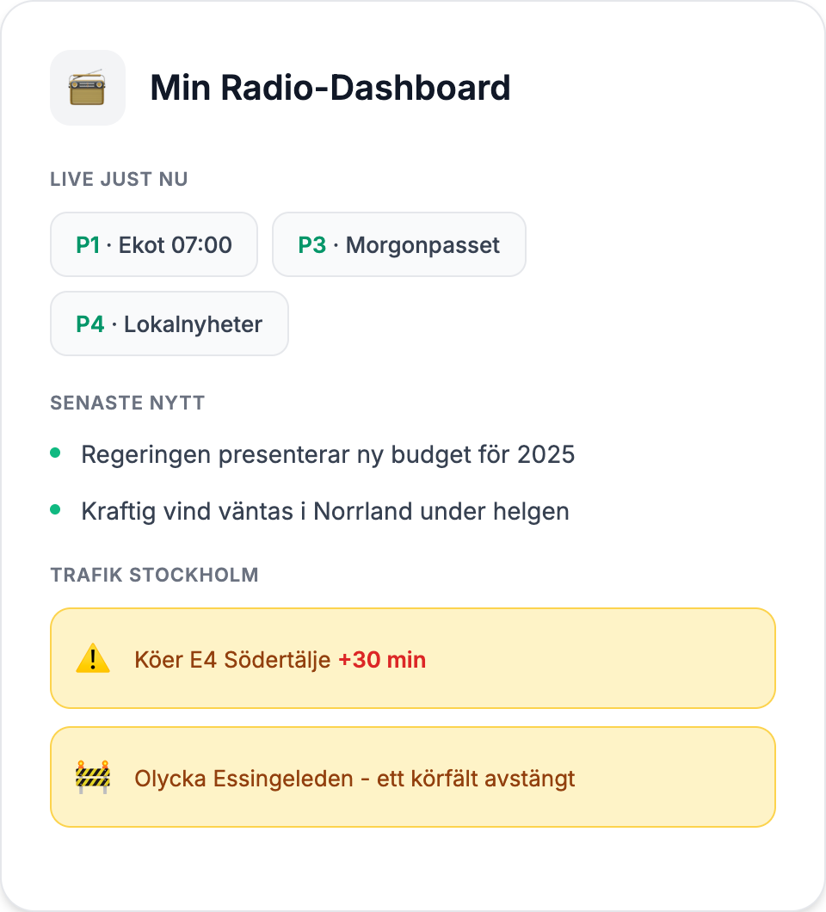
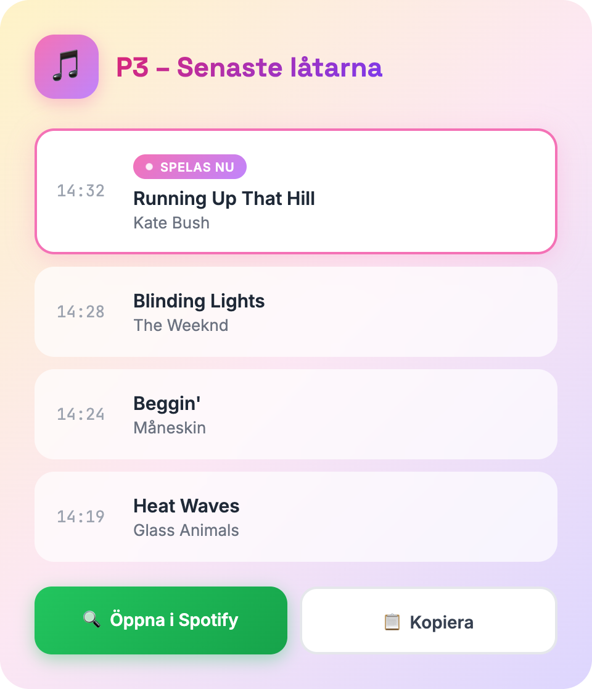
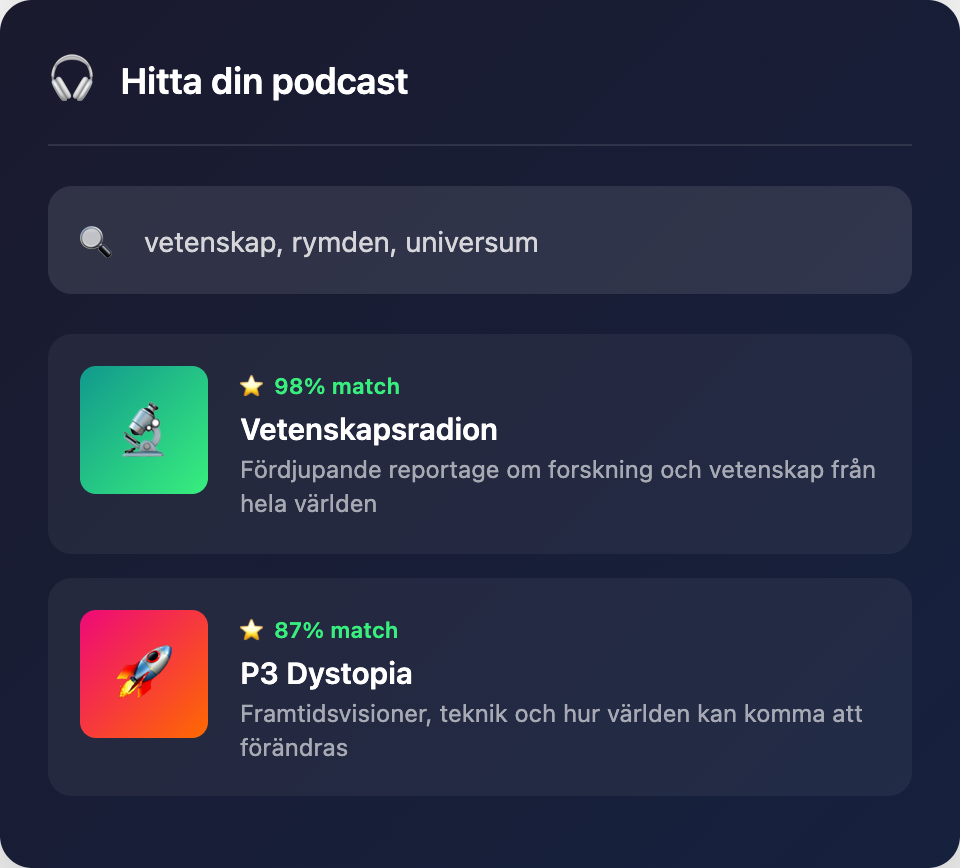
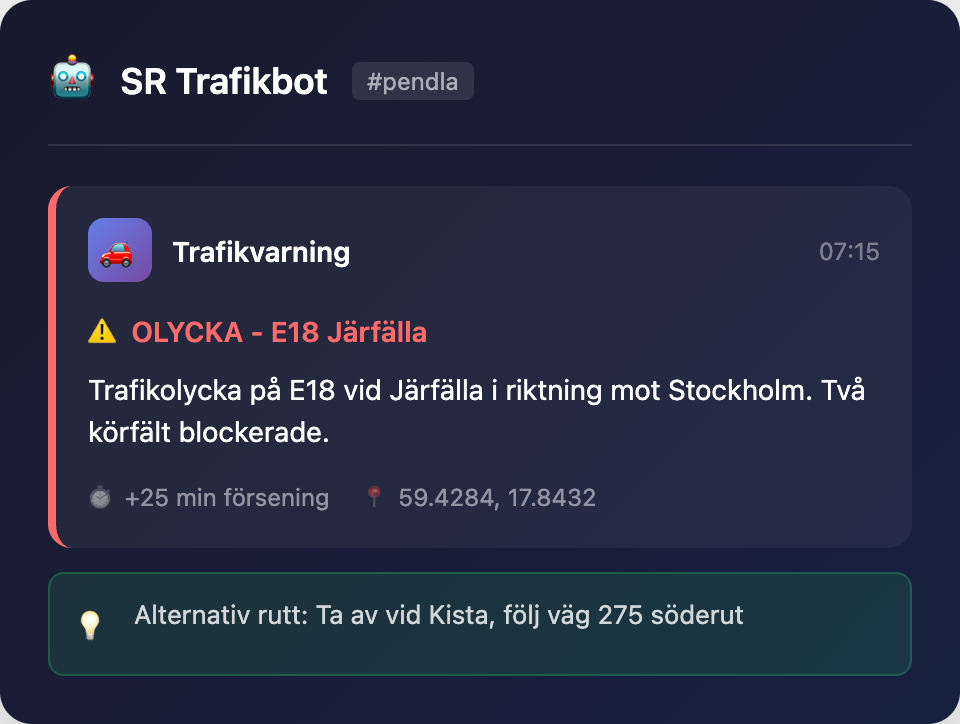

<p align="center">
  
</p>

<p align="center">
  <a href="https://sverigesradio-mcp.onrender.com/health"></a>
  <a href="https://registry.modelcontextprotocol.io"></a>
  <a href="https://modelcontextprotocol.io"></a>
  <a href="https://opensource.org/licenses/MIT"></a>
  <a href="https://www.typescriptlang.org/"></a>
</p>

<p align="center">
  <strong>MCP-server for Sveriges Radio's Open API - access Swedish public radio programs, podcasts, live streams, playlists, news and traffic information.</strong>
</p>

<p align="center">
  <em>MCP-server för Sveriges Radios Öppna API - tillgång till svensk public service-radio: program, podcasts, liveströmmar, spellistor, nyheter och trafikinformation.</em>
</p>

---

## Användningsområden

Koppla MCP-servern till din AI-assistent och ställ frågor på naturligt språk. Här är fyra huvudsakliga användningsområden - med exempelfrågor, tillgängliga tools och app-idéer:

---

### 📻 1. Live-radio, Nyheter & Trafik

Håll koll på vad som händer just nu - perfekt för morgonrutinen.

<details open>
<summary><strong>Exempelfrågor du kan ställa</strong></summary>

> *"Ge mig en morgonöversikt - vad sänds på P1, senaste nyheterna och trafikläget i Stockholm"*
>
> *"Vilka program sänds live just nu?"*
>
> *"Sammanfatta de senaste nyheterna från Ekot"*
>
> *"Vad har hänt i Sverige idag?"*
>
> *"Vad går på P1 ikväll mellan 18-21?"*

</details>

<details>
<summary><strong>Tools</strong></summary>

| Tool | Beskrivning |
|------|-------------|
| `get_all_rightnow` | Vad som spelas på ALLA kanaler just nu |
| `get_channel_rightnow` | Aktuellt program på en specifik kanal |
| `list_channels` | Alla kanaler (P1-P4, lokalstationer) |
| `get_channel_schedule` | Tablå för en kanal och datum |
| `list_news_programs` | Översikt av nyhetsprogram |
| `get_latest_news_episodes` | Senaste nyhetssändningar |
| `get_traffic_messages` | Trafikmeddelanden per område |
| `get_traffic_areas` | Trafikområden (med GPS-uppslag) |

</details>

**Bygg en app:** Personlig Radio-Dashboard



---

### 🎵 2. Musik & Spellistor

Hitta låtar du hört på radion och utforska musikhistorik.

<details>
<summary><strong>Exempelfrågor du kan ställa</strong></summary>

> *"Vilken låt spelades på P3 för ungefär 20 minuter sedan?"*
>
> *"Visa de senaste 10 låtarna som spelats på P2 Musik"*
>
> *"Vilka artister spelas mest på P4?"*
>
> *"Vad spelade de i gårdagens Morgonpasset?"*

</details>

<details>
<summary><strong>Tools</strong></summary>

| Tool | Beskrivning |
|------|-------------|
| `get_playlist_rightnow` | Aktuell låt (föregående, nuvarande, nästa) |
| `get_channel_playlist` | Låthistorik för en kanal inom tidsintervall |
| `get_program_playlist` | Låthistorik för ett program |
| `get_episode_playlist` | Komplett spellista för ett avsnitt |

*Metadata: titel, artist, kompositör, album, skivbolag, producent, textförfattare, tidsstämplar*

</details>

**Bygg en app:** "Vad var det för låt?" - Musikidentifierare med Spotify-integration



---

### 🎧 3. Podcasts & Program

Hitta nya podcasts, sök i avsnitt och planera ditt lyssnande.

<details>
<summary><strong>Exempelfrågor du kan ställa</strong></summary>

> *"Jag gillar true crime och dokumentärer. Vilka SR-podcasts passar mig?"*
>
> *"Finns det några bra podcasts om svensk historia?"*
>
> *"Rekommendera en podd för min 45-minuters pendling"*
>
> *"Hitta alla avsnitt av Vetenskapsradion som handlar om AI"*
>
> *"När sänds nästa avsnitt av Filosofiska rummet?"*
>
> *"Vilka programkategorier finns på Sveriges Radio?"*

</details>

<details>
<summary><strong>Tools</strong></summary>

| Tool | Beskrivning |
|------|-------------|
| `search_programs` | Sök efter program (med relevansranking) |
| `get_program` | Hämta programdetaljer |
| `list_program_categories` | Alla 15 programkategorier |
| `get_program_schedule` | När ett program sänds |
| `list_broadcasts` | Tillgängliga sändningar (30 dagar) |
| `list_podfiles` | Podcastfiler för ett program |
| `get_podfile` | Specifik podcastfil med metadata |
| `list_episodes` | Lista avsnitt från ett program |
| `search_episodes` | Fulltextsökning i avsnitt |
| `get_episode` | Specifikt avsnitt med ljudfiler |
| `get_latest_episode` | Senaste avsnittet för ett program |
| `get_program_broadcasts` | Kommande sändningar |

</details>

**Bygg en app:** Podcast-rekommendationsmotor baserat på dina intressen



---

### 🚗 4. Trafikbevakning

Realtidsinfo om trafikstörningar för din pendling.

<details>
<summary><strong>Exempelfrågor du kan ställa</strong></summary>

> *"Finns det några trafikproblem på E4:an just nu?"*
>
> *"Hur är trafikläget i Stockholm?"*
>
> *"Vilka vägar har störningar i Göteborg?"*
>
> *"Ge mig trafikinfo för min pendling Upplands Väsby → Stockholm"*

</details>

<details>
<summary><strong>Tools</strong></summary>

| Tool | Beskrivning |
|------|-------------|
| `get_traffic_messages` | Trafikmeddelanden per område |
| `get_traffic_areas` | Trafikområden (med GPS-uppslag) |

</details>

**Bygg en app:** Trafikvarnings-bot för Slack/Discord som varnar ditt team



---

### Kombinera med andra AI-verktyg

| Kombination | Exempel |
|-------------|---------|
| **+ Kalender** | *"Lägg till Konflikt i min kalender när det sänds"* |
| **+ Webbsökning** | *"Sök mer info om artisten som spelas på P3 just nu"* |
| **+ Anteckningar** | *"Spara länken till senaste P3 Dokumentär"* |

---

## Snabbstart

### Alternativ 1: Remote Server (Rekommenderat)

**Ingen installation krävs!** Använd vår hostade server direkt.

<details>
<summary><strong>ChatGPT</strong></summary>

1. Gå till **Settings** → **Connected Apps** → **Add Plugin**
2. Välj "Add custom MCP server"
3. Ange URL: `https://sverigesradio-mcp.onrender.com/mcp`

</details>

<details>
<summary><strong>Claude Desktop / Claude Code</strong></summary>

Lägg till i din MCP-konfiguration (`claude_desktop_config.json` eller `.claude.json`):

```json
{
  "mcpServers": {
    "sverigesradio": {
      "url": "https://sverigesradio-mcp.onrender.com/mcp"
    }
  }
}
```

</details>

<details>
<summary><strong>Cursor</strong></summary>

Lägg till i `.cursor/mcp.json`:

```json
{
  "mcpServers": {
    "sverigesradio": {
      "transportType": "streamable-http",
      "url": "https://sverigesradio-mcp.onrender.com/mcp"
    }
  }
}
```

</details>

<details>
<summary><strong>Andra MCP-klienter</strong></summary>

Använd **StreamableHTTP transport** (MCP 2025-03-26 spec):
- **Endpoint:** `https://sverigesradio-mcp.onrender.com/mcp`
- **Auth:** Ingen (publikt API)
- **Format:** JSON-RPC 2.0

</details>

---

### Alternativ 2: npm-paket

```bash
npx sverigesradio-mcp
```

Eller installera globalt:

```bash
npm install -g sverigesradio-mcp
sverigesradio-mcp
```

---

### Alternativ 3: Lokal Installation

```bash
git clone https://github.com/isakskogstad/Sveriges.Radio-MCP.git
cd Sveriges.Radio-MCP
npm install
npm run build
npm start
```

<details>
<summary><strong>Lägg till i Claude Code</strong></summary>

```bash
claude mcp add sverigesradio node /path/to/Sveriges.Radio-MCP/dist/index.js
```

</details>

---

## Översikt

| Kategori | Antal | Beskrivning |
|----------|-------|-------------|
| **Tools** | 32 | Program, kanaler, avsnitt, spellistor, nyheter, trafik |
| **Resources** | 4 | API-info, kanallista, ljudkvalitet, kategorier |
| **Prompts** | 6 | Fördefinierade arbetsflöden för vanliga uppgifter |

---

## Teknisk Stack

| Komponent | Teknologi |
|-----------|-----------|
| **Runtime** | Node.js 20+ |
| **Språk** | TypeScript 5.6 |
| **MCP SDK** | @modelcontextprotocol/sdk |
| **Transport** | StreamableHTTP (MCP 2025-03-26) |
| **API** | Sveriges Radio Open API v2 |
| **Hosting** | Render (Frankfurt) |

### Säkerhetsfunktioner

| Funktion | Beskrivning |
|----------|-------------|
| **Session TTL** | Automatisk rensning av inaktiva sessioner (30 min) |
| **Rate Limiting** | Konfigurerbar per-IP begränsning (60 req/min) |
| **UUID Validering** | Säker session ID-validering |
| **CORS** | Konfigurerbara tillåtna origins |
| **Strukturerad Loggning** | JSON-formaterade loggar för övervakning |

---

## Konfiguration

| Variabel | Standard | Beskrivning |
|----------|----------|-------------|
| `PORT` | `3000` | HTTP-serverport |
| `MCP_AUTH_TOKEN` | - | Valfri Bearer-token för autentisering |
| `ALLOWED_ORIGINS` | `*` | CORS origins (kommaseparerade eller * för alla) |
| `SESSION_TTL_MS` | `1800000` | Session timeout (30 min standard) |
| `RATE_LIMIT_REQUESTS` | `60` | Max requests per minut per IP |

---

## Utveckling

```bash
npm run dev          # Utvecklingsläge (stdio)
npm run dev:http     # HTTP-server utveckling
npm run build        # Bygg för produktion
npm test             # Kör tester
```

---

## Licens

MIT (c) Isak Skogstad

---

## Länkar

- [GitHub Repository](https://github.com/isakskogstad/Sveriges.Radio-MCP)
- [SR API Dokumentation](https://api.sr.se/api/documentation/v2/)
- [MCP Protocol](https://modelcontextprotocol.io)
- [Changelog](CHANGELOG.md)

---

## Support

Skapa ett [GitHub Issue](https://github.com/isakskogstad/Sveriges.Radio-MCP/issues) för bugrapporter eller funktionsförfrågningar.
